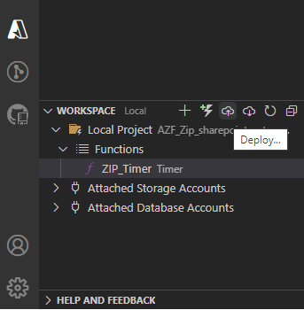
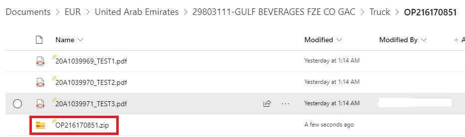

# AZF_Zip_sharepoint_automation
 
## Automation Task Summary

1. Create a connection to database
2. Query & get the folder path from DB for ticket_upload_status = Ready if Exists
3. For condition No, Abort the process      
4. For condition Yes
    - Create a dataframe
    - Get all the unique folder path in an array & perform loop operation
    - connect to Sharepoint
        - Ensure folder path is available
        - get the list of files exist on the folder
        - firstly, check if there is any PDF files are available
        - If No, abort the process
        - If yes,
            - Now check if are no ZIP file available on the folder
            - If No, abort the process
            - If Yes
                - start compress/add all the PDF files into the ZIP files
                - Write & store it on the memory
                - Now delimit the sharepoint folder path with "/" and get the name after the value "Truck/Ocean" [shipping condition] 
                    to save the Zip file on the folder based on the condition
                    - If Truck, then save the zip file with a name PO_number.zip
                    - If Ocean, then save the Zip file with a name Booking_number.zip

## Procedure

1. First initialize the application varibles in application settings of function app in azure portal.
[**How to set Environment Variables in Azure Functions**](https://iotespresso.com/how-to-set-environment-variables-in-azure-functions/)


2. All third party python libraries can be defined in `requirement.txt` file to include into your environment. 

```txt
azure-functions
pandas
pyodbc
fast_to_sql
azure-storage-blob
Office365-REST-Python-Client
Python-dotenv
```

| Packages                     | official Documentation                                 |
|------------------------------|--------------------------------------------------------|
| azure-functions              | https://pypi.org/project/azure-functions/              |
| pandas                       | https://pypi.org/project/pandas/                       |
| pyodbc                       | https://pypi.org/project/pyodbc/                       |
| fast_to_sql                  | https://pypi.org/project/fast-to-sql/                  |
| azure-storage-blob           | https://pypi.org/project/azure-storage-blob/           |
| office365-REST-Python-Client | https://pypi.org/project/Office365-REST-Python-Client/ |
| pip install python-dotenv    | https://pypi.org/project/python-dotenv/                |

  After defining those packages you can import in your python code.
  
  ```python
import datetime 
import logging
import azure.functions as func
#Dotenv Libraries
from dotenv import load_dotenv
import os
#Pandas Libraries
import pandas as pd
#Sql libraries
import pyodbc
#Zip libraries
import zipfile
#Memory libraries
from io import BytesIO
#Office365 libraries
from office365.sharepoint.client_context import ClientContext
from office365.runtime.auth.user_credential import UserCredential
#Warnings libraries
import warnings
warnings.filterwarnings("ignore", category=DeprecationWarning)
warnings.filterwarnings("ignore", category=UserWarning)
  ```

  Here is the main function of our Python code. **Call all your application varibles in your main function using os.environ[' ']**
  
  ```python
  def main(mytimer: func.TimerRequest) -> None:
    utc_timestamp = datetime.datetime.utcnow().replace(
        tzinfo=datetime.timezone.utc).isoformat()

    if mytimer.past_due:
        logging.info('The timer is past due!')
    
    #GET THE APPLICATION SETTING VARIABLES    
    DB_DRIVER = os.environ['DB_DRIVER']
    DB_SERVER = os.environ['DB_SERVER']
    DB_DATABASE = os.environ['DB_DATABASE']
    DB_USERNAME = os.environ['DB_USERNAME']
    DB_PASSWORD = os.environ['DB_PASSWORD']
    DB_TABLE_TC = os.environ['DB_TABLE_TC']
    DB_TABLE_MSC = os.environ['DB_TABLE_MSC']
    SP_SITE = os.environ['SP_SITE']
    SP_FOLDER = os.environ['SP_FOLDER']
    SP_USERNAME = os.environ['SP_USERNAME']
    SP_PASSWORD = os.environ['SP_PASSWORD']

    Hconn = "Driver=" + "{" + DB_DRIVER + "};" + "Server=" + DB_SERVER + ";" + "Database=" + DB_DATABASE + ";" + "uid=" + DB_USERNAME + ";" + "pwd=" + DB_PASSWORD + ";" + "Trusted_Connection = yes;"
    logging.info(Hconn)
    cnxn = pyodbc.connect(Hconn)

    try:
        cnxn.execute("SELECT 1")
        logging.info("Database is connected")

        ZIP_pd = pd.read_sql_query('''
            SELECT 
            H.sales_order_number,
            H.booking_number,
            H.customer_purchase_order_number,
            V.shipping,
            H.folder_path 
            FROM ''' + DB_TABLE_TC + ''' AS H 
            LEFT JOIN''' + DB_TABLE_MSC + ''' AS V ON V.shipping_condition = H.shipping_conditions
            WHERE ticket_upload_status = 'Ready' 
        ''',cnxn)
        ZIP_HV = pd.DataFrame(ZIP_pd)
        ZIP = ZIP_HV['folder_path'].unique()
        logging.info(ZIP)
        if (ZIP.size > 0):
            for i in ZIP:
            #CONNECTION TO SHAREPOINT
                ctx = ClientContext(SP_SITE).with_credentials(UserCredential(SP_USERNAME, SP_PASSWORD))    
                list_title = SP_FOLDER
                ##### ENSURE FOLDER IS AVAILABLE ON THE SHAREPOINT ####
                HVpath = list_title + "/" + i
                target_folder = ctx.web.ensure_folder_path(HVpath).execute_query()
                logging.info(HVpath + " " + "is available")
                files_ZIP = target_folder.files.get().execute_query()
                #CHECK IF PDF FILE & ZIP FILE AVAILABLE
                PDF_files = [f for f in files_ZIP if f.properties["Name"].lower().endswith(".pdf")]
                zip_files = [f for f in files_ZIP if f.properties["Name"].lower().endswith(".zip")]
                #IF PDF FILE AVAILABLE
                if len(PDF_files) > 0:
                    if len(zip_files) > 0:
                        logging.info("There is already one file with the .zip extension exist on this folder : " + HVpath)
                    else:
                        # CREATE ZIP FILE IN MEMORY
                        zip_data = BytesIO()
                        with zipfile.ZipFile(zip_data, mode='w') as zip_file:
                        # ADD EACH PDF FILE TO THE ZIPFILE
                            for file in PDF_files:
                                file_name = file.properties["Name"]
                                file_content = file.read()
                                zip_file.writestr(file_name, file_content)
                            zip_file.close()
                        zip_data.seek(0)
                        ## DELIMIT TARGET FOLDER WITH "/"
                        string_value = i
                        separated_values = string_value.split("/")
                        if "Truck" in separated_values:
                            PO_number = separated_values.index("Truck") + 1
                            if PO_number < len(separated_values):
                                PO_data = separated_values[PO_number]
                                ZIP_file_name = PO_data + ".zip"
                                target_file = target_folder.upload_file(ZIP_file_name, zip_data.getvalue()).execute_query()
                                logging.info("ZIPFile uploaded to url: {0}".format(target_file.serverRelativeUrl))
                        if "Ocean" in separated_values:
                            Book_number = separated_values.index("Ocean") + 1
                            if Book_number < len(separated_values):
                                Book_data = separated_values[Book_number]
                                ZIP_file_name = Book_data + ".zip"
                                target_file = target_folder.upload_file(ZIP_file_name, zip_data.getvalue()).execute_query()
                                logging.info("ZIPFile has been uploaded to url: {0}".format(target_file.serverRelativeUrl))
                else:
                    logging.info("There are no files with the .pdf extension in the folder.")
        else:
            logging.info("Upload Status is Ready However Folder_path is empty. So aborted the process")

    except pyodbc.Error:
        logging.info("Database is not connected. please check the connection")

    logging.info('Python timer trigger function ran at %s', utc_timestamp)
    
  ```

2. After you test your function select "Deploy to Function App" to publish your local Azure funtion app to Azure Functions App.



3. Finally, the azure timertrigger function app run for every day at 5 AM [**Cron Generator**](https://crontab.guru/#*_*_*_*) and automatically save ZIP file from on the sharepoint folder.

**Output**



## Materials

* [Taking a closer look at Python support for Azure Functions](https://azure.microsoft.com/en-us/blog/taking-a-closer-look-at-python-support-for-azure-functions)
* More details about [Azure Functions for Visual Studio Code (Preview)
](https://github.com/Microsoft/vscode-azurefunctions)
* More details about [Create your first Python function in Azure (Preview)
](https://docs.microsoft.com/en-us/azure/azure-functions/functions-create-first-function-python)
* More details about [Timer trigger for Azure Functions using python (Preview)
](https://learn.microsoft.com/en-us/azure/azure-functions/functions-bindings-timer)
* [Cron generator for timertrigger](https://crontab.guru/#*_*_*_*)

Thanks!!